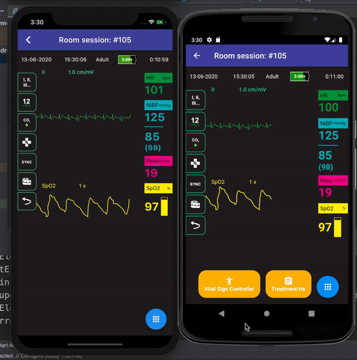

# EMSDojo    
#### An Approach to Digitisation in Education

---

## [Table of contents](#table-of-contents)
1. [Introduction](#introduction)
2. [Project Context](#projectcontext)
3. [Project Stack](#projectstack)
4. [Benefits](#benefits)
5. [Examples](#examples)

---

## [Introduction](#introduction)

EMS Dojo is a mobile application that enables paramedic students to interactively learn through a realistic Zoll X-Series simulator using a Tester and Trainee Mode.
Tester will be able to set medical case scenarios with dynamic vital signs values which will be reflected in real-time for students. Training data is quantifiable, providing tester the insights they need to help better the student’s weakness. Furthermore, through realistic sounds effects and real-time changes, it will drive better knowledge retention and user engagement.

It was named EMSDojo because Dojo is like a place of development for martial artist to practice their art. It is where they continuously practice, fall and get up to get better. Riding on that same sentiment, this app would be a platform where pmts through high repetition reinforce and challenges their practice, decreasing their errors in their clinical practice over time.

[ <a href="#table-of-contents">↑ to top ↑</a> ]

## [ProjectContext](#projectcontext)
- Realistic F2F training can be inhibited by availability of equipment, venue, high student-to-equipment ratio and COVID.
- Over-reliance on educators as the only knowledge broker.
- Transient lost of patient contact during courses might reduce equipment and patient management proficiency.

---

## [ProjectStack](#projectstack) 
The project was made using Flutter with Firebase as a Backend as a Service.
ECG & Spo2 Waveforms were hand-drawn using Photoshop and animated using SVG.

[ <a href="#table-of-contents">↑ to top ↑</a> ]

## [Benefits](#benefits)
- Quantifiable Training
Tracking, analysing, and reporting on training data helps to provide educators with more credibility and insights that can be used to modify future programs. Collected data can also be shared with mentors and trainees to be used as a part of the trainee’s assessment

- Better Knowledge Retention Through real-time updates, interactive display and realistic sound effects, it will drive better knowledge retention and higher user engagement .

- Reduce Costs and Time
Issues regarding time or venue becomes negligible. The pure transfer of knowledge can take place digitally. Training can be done with mentors at station or amongst the trainees at home via phone call. Multiple training sessions can be done simultaneously!

- Promoting peer-to-peer learning
Promote collaborative learning amongst trainees, optimising each other’s learning, developing oral communication and preparation for real life scenario.

[ <a href="#table-of-contents">↑ to top ↑</a> ]

## [Examples](#examples)

Other Screens

    

[ <a href="#table-of-contents">↑ to top ↑</a> ]

